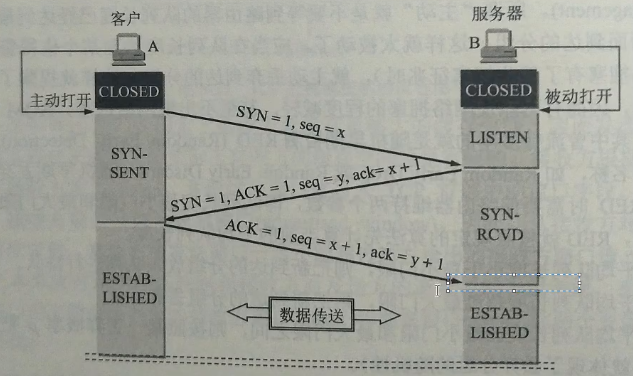
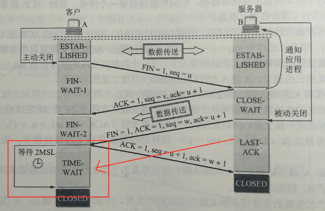
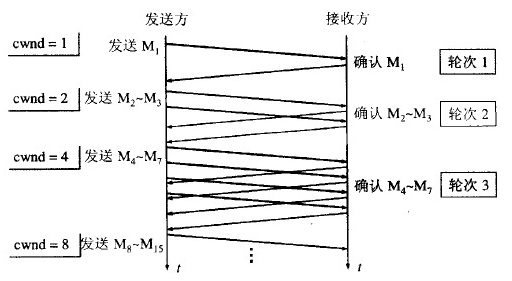
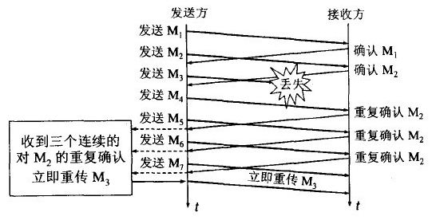
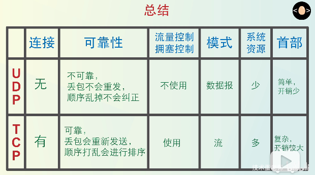

#  Computer Network

## tcp建立连接与断开

- 三次握手

SYN(Synchronize)：表示同步序列编号(Synchronize Sequence Numbers)是否有效。该标志仅在三次握手建立TCP连接时有效.

FIN(Finish)：带有该标志置位的数据包用来结束一个TCP会话，但对应端口仍处于开放状态，准备接收后续数据。当FIN标志有效的时候我们称呼这个包为FIN包。

其实只建立了一次连接，准确来说就是三报文握手。
1. 为什么不需要两次握手？
    答：client 发出的第一个连接请求报文段并没有丢失，而是在某个网络结点长时间的滞留了，以致延误到连接释放以后的某个时间才到达 server。本来这是一个早已失效的报文段。但 server 收到此失效的连接请求报文段后，就误认为是 client 再次发出的一个新的连接请求。于是就向 client 发出确认报文段，同意建立连接。假设不采用 “三次握手”，那么只要 server 发出确认，新的连接就建立了。由于现在 client 并没有发出建立连接的请求，因此不会理睬 server 的确认，也不会向 server 发送数据。但 server 却以为新的运输连接已经建立，并一直等待 client 发来数据。这样，server 的很多资源就白白浪费掉了。采用 “三次握手” 的办法可以防止上述现象发生。例如刚才那种情况，client 不会向 server 的确认发出确认。server 由于收不到确认，就知道 client 并没有要求建立连接。

2. tcp三次握手最后一个ack丢包了会怎么样？

    答：客户端在发送第三个`ACK`之后，已经进入了`establish`状态，如果这个`ACK`丢失了，此时服务端还处于`syn-received`状态。
    这时分两种情况：
    - 客户端建立连接后，不发送数据；
    - 客户端建立连接后，立马发送数据；
    如果是第一种情况，`ACK`丢失会触发服务端`SYN/ACK`重传。（但是为了防止`SYN flood`攻击，有些网站关闭了`SYN/ACK`重传，比如百度）

- 四次挥手

为什么四次挥手？
    答：分两次断开，A到B先断开；之后B到A断开。我们注意到B发送的序列号`seq=v,seq=w`不是连续的，这是因为B到A还未断开，中间有数据发送。

为什么有`TIME-WAIT`？
    答：A收到报文后向B发送的报文未收到，若立即关闭连接，那么B超时重传后发送的报文，A也是收不到的。`TIME-WAIT`就是为了防止这种现象发生。
    如果Server没有收到ACK，就会重发FIN，如果Client在2*MSL的时间内收到了FIN，就会重新发送ACK并再次等待2MSL，防止Server没有收到ACK而不断重发FIN。
    MSL(Maximum Segment Lifetime)，指一个片段在网络中最大的存活时间，2MSL就是一个发送和一个回复所需的最大时间。如果直到2MSL，Client都没有再次收到FIN，那么Client推断ACK已经被成功接收，则结束TCP连接。

## 拥塞控制

拥塞控制主要由四个算法组成：**慢启动（Slow Start）、拥塞避免（Congestion voidance）、快重传 （Fast Retransmit）、快恢复（Fast Recovery）**

1. 慢启动：刚开始发送数据时，先把拥塞窗口（congestion window）设置为一个最大报文段MSS的数值，每收到一个新的确认报文之后，就把拥塞窗口加1个MSS。这样每经过一个传输轮次（或者说是每经过一个往返时间RTT），拥塞窗口的大小就会加倍

2. 拥塞避免：当拥塞窗口的大小达到慢开始门限(slow start threshold)时，开始执行拥塞避免算法，拥塞窗口大小不再指数增加，而是线性增加，即每经过一个传输轮次只增加1MSS.  
> 无论在慢开始阶段还是在拥塞避免阶段，只要发送方判断网络出现拥塞（其根据就是没有收到确认），就要把慢开始门限ssthresh设置为出现拥塞时的发送方窗口值的一半（但不能小于2）。然后把拥塞窗口cwnd重新设置为1，执行慢开始算法。**（这是不使用快重传的情况）**

3. 快重传：快重传要求接收方在收到一个失序的报文段后就立即发出**重复确认**（为的是使发送方及早知道有报文段没有到达对方）而不要等到自己发送数据时捎带确认。快重传算法规定，发送方只要一连收到三个重复确认就应当立即重传对方尚未收到的报文段，而不必继续等待设置的重传计时器时间到期。

4. 快恢复：当发送方连续收到三个重复确认时，就把慢开始门限减半，然后执行拥塞避免算法。不执行慢开始算法的原因：因为如果网络出现拥塞的话就不会收到好几个重复的确认，所以发送方认为现在网络可能没有出现拥塞。  
也有的快重传是把开始时的拥塞窗口cwnd值再增大一点，即等于 ssthresh + 3*MSS 。这样做的理由是：既然发送方收到三个重复的确认，就表明有三个分组已经离开了网络。这三个分组不再消耗网络的资源而是停留在接收方的缓存中。可见现在网络中减少了三个分组。因此可以适当把拥塞窗口扩大些。

## 网络7层协议

第一层：应用层。定义了用于在网络中进行通信和传输数据的接口；
第二层：表示层。定义不同的系统中数据的传输格式，编码和解码规范等；
第三层：会话层。管理用户的会话，控制用户间逻辑连接的建立和中断；
第四层：传输层。管理着网络中的端到端的数据传输；
第五层：网络层。定义网络设备间如何传输数据,控制子网运行，如逻辑编制，地址划分，路由选择等；
第六层：链路层。将上面的网络层的数据包封装成数据帧，便于物理层传输；
第七层：物理层。这一层主要就是传输这些二进制数据。
## Session Cookie
### Session Cookie区别

Session是在服务端保存的一个数据结构，用来跟踪用户的状态，这个数据可以保存在集群、数据库、文件中；
Cookie是客户端保存用户信息的一种机制，用来记录用户的一些信息，也是实现Session的一种方式。
token也类似一个令牌，无状态，用户信息都被加密到token中，服务器收到token后解密就可知道是哪个用户。需要开发者手动添加

token就是令牌，比如你授权（登录）一个程序时，他就是个依据，判断你是否已经授权该软件；cookie就是写在客户端的一个txt文件，里面包括你登录信息之类的，这样你下次在登录某个网站，就会自动调用cookie自动登录用户名；session和cookie差不多，只是session是写在服务器端的文件，也需要在客户端写入cookie文件，但是文件里是你的浏览器编号.Session的状态是存储在服务器端，客户端只有session id；而Token的状态是存储在客户端。
作者：骑小猪看流星
链接：https://www.jianshu.com/p/bd1be47a16c1
### Session Cookie选择
Cookie 只能存储 ASCII 码字符串，而 Session 则可以存储任何类型的数据，因此在考虑数据复杂性时首选 Session；
Cookie 存储在浏览器中，容易被恶意查看。如果非要将一些隐私数据存在 Cookie 中，可以将 Cookie 值进行加密，然后在服务器进行解密；
对于大型网站，如果用户所有的信息都存储在 Session 中，那么开销是非常大的，因此不建议将所有的用户信息都存储到 Session 中。

## TCP UDP 区别

1.基于连接与无连接；

2.对系统资源的要求（TCP较多，UDP少）；

3.UDP程序结构较简单；

4.模式与数据报模式 ；

5.TCP保证数据正确性，UDP可能丢包；

6.TCP保证数据顺序，UDP不保证。
### TCP UDP应用场景
对某些实时性要求比较高的情况，选择UDP，比如游戏，媒体通信，实时视频流（直播），即使出现传输错误也可以容忍；其它大部分情况下，HTTP都是用TCP，因为要求传输的内容可靠，不出现丢失

### TCP如何保证传输的可靠性
1. 数据包校验
2. 对失序数据包重新排序（TCP报文具有序列号）
3. 丢弃重复数据
4. 应答机制：接收方收到数据之后，会发送一个确认（通常延迟几分之一秒）；
5. 超时重发：发送方发出数据之后，启动一个定时器，超时未收到接收方的确认，则重新发送这个数据；
6. 流量控制：确保接收端能够接收发送方的数据而不会缓冲区溢出
### TCP粘包
TCP粘包就是指发送方发送的若干包数据到达接收方时粘成了一包，从接收端缓冲区来看，后一包数据的头紧接着前一包数据的尾。

如果发送方发送的多组数据本来就是同一块数据的不同部分，比如说一个文件被分成多个部分发送，这时当然不需要处理粘包现象；如果多个分组毫不相干，甚至是并列关系，那么这个时候就一定要处理粘包现象了

出现粘包的原因：

- 发送方：默认使用**Nagle算法**（主要作用：减少网络中报文段的数量），将多次间隔较小、数据量较小的数据，合并成一个数据量大的数据块，进行发送；
- 接收方：TCP将接收到的数据包保存在**接收缓存**里，然后应用程序主动从缓存读取收到的分组。
如果TCP接收数据包到缓存的速度大于应用程序从缓存中读取数据包的速度，多个包就会被缓存，应用程序就有可能读取到多个首尾相接粘到一起的包。

#### 如何解决粘包问题？

展开

- 发送方：关闭Nagle算法；
- 接收方：在应用层进行处理。将所有数据全部读完之后，再进行分组。分组的方法可以通过规定开始符和结束符的方法；也可以在每组数据前加上数据长度。

## 网际控制报文协议 ICMP
ICMP 是为了更有效地转发 IP 数据报和提高交付成功的机会。它封装在 IP 数据报中，但是不属于高层协议。

ICMP 报文分为差错报告报文和询问报文。

### 1. Ping
Ping 是 ICMP 的一个重要应用，主要用来测试两台主机之间的连通性。
Ping 的原理是通过向目的主机发送 ICMP Echo 请求报文，目的主机收到之后会发送 Echo 回答报文。Ping 会根据时间和成功响应的次数估算出数据包往返时间以及丢包率。

### 2. Traceroute
Traceroute 是 ICMP 的另一个应用，用来跟踪一个分组从源点到终点的路径。

Traceroute 发送的 IP 数据报封装的是无法交付的 UDP 用户数据报，并由目的主机发送终点不可达差错报告报文。

- 源主机向目的主机发送一连串的 IP 数据报。第一个数据报 P1 的生存时间 TTL 设置为 1，当 P1 到达路径上的第一个路由器 R1 时，R1 收下它并把 TTL 减 1，此时 TTL 等于 0，R1 就把 P1 丢弃，并向源主机发送一个 ICMP 时间超过差错报告报文；

- 源主机接着发送第二个数据报 P2，并把 TTL 设置为 2。P2 先到达 R1，R1 收下后把 TTL 减 1 再转发给 R2，R2 收下后也把 TTL 减 1，由于此时 TTL 等于 0，R2 就丢弃 P2，并向源主机发送一个 ICMP 时间超过差错报文。
- 不断执行这样的步骤，直到最后一个数据报刚刚到达目的主机，主机不转发数据报，也不把 TTL 值减 1。但是因为数据报封装的是无法交付的 UDP，因此目的主机要向源主机发送 ICMP 终点不可达差错报告报文。
- 之后源主机知道了到达目的主机所经过的路由器 IP 地址以及到达每个路由器的往返时间。
## http 长连接 短链接
在HTTP/1.0中，默认使用的是短连接。也就是说，浏览器和服务器每进行一次HTTP操作，就建立一次连接，但任务结束就中断连接。如果客户端浏览器访问的某个HTML或其他类型的 Web页中包含有其他的Web资源，如JavaScript文件、图像文件、CSS文件等；当浏览器每遇到这样一个Web资源，就会建立一个HTTP会话。

但从 HTTP/1.1起，默认使用长连接，用以保持连接特性。使用长连接的HTTP协议，会在响应头有加入这行代码：

`Connection:keep-alive`
　　在使用长连接的情况下，当一个网页打开完成后，客户端和服务器之间用于传输HTTP数据的 TCP连接不会关闭，如果客户端再次访问这个服务器上的网页，会继续使用这一条已经建立的连接。Keep-Alive不会永久保持连接，它有一个保持时间，可以在不同的服务器软件（如Apache）中设定这个时间。实现长连接要客户端和服务端都支持长连接。

HTTP协议的长连接和短连接，实质上是TCP协议的长连接和短连接。

## http与https
`http`(超文本传输协议），以明文的方式发送我们的访问内容，无加密，如：登录某个网站，可能需要需要用户名，密码。这些字段可能被人截获。
为了解决这个问题，增加了`SSL`协议，这个协议就是提供数据安全和完整性的协议，负责网络连接的加密。现在我们的电脑访问某个`https`网站，首先会与服务器建立通道，服务器发送网站证书到我们电脑，确认消息之后，服务器生成一个加锁的箱子，这个箱子有不同两把钥匙，一把给电脑，一把是自己的。之后我们发送的内容放到箱子里再给上锁，服务器收到后用自己的钥匙要是打开，以此保证信息的安全。

## 参考文章
[关于三次握手与四次挥手面试官想考我们什么？-掘金](https://juejin.im/post/5ccd0dfc6fb9a0324a08bb73)
[TCP协议中Seq、Ack的变化规律](http://www.xumenger.com/tcp-seq-ack-20180605/)
[网络七层协议](https://blog.csdn.net/yaopeng_2005/article/details/7064869)
[COOKIE和SESSION有什么区别？--知乎](https://www.zhihu.com/question/19786827/answer/28752144)
[HTTP长连接和短连接](https://www.cnblogs.com/0201zcr/p/4694945.html)
[深入理解HTTPS工作原理--掘金](https://juejin.im/post/5ca6a109e51d4544e27e3048#heading-9)

