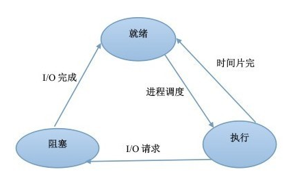

# Operation System
* 操作系统
    * [线程进程](#线程进程)
    * [什么是缓存？有哪些缓存的更新算法？](#什么是缓存？有哪些缓存的更新算法？)
    * [临界区](#临界区)
    * [同步与互斥](#同步与互斥)
    * [并发、并行、异步的区别？](#并发、并行、异步的区别？)
    * [进程调度策略有哪些？](#进程调度策略有哪些？)
    * [并发、并行、异步的区别？](#并发、并行、异步的区别？)
    * [互斥量和临界区有什么区别？](#互斥量和临界区有什么区别？)
    * [用户态 内核态](#用户态-内核态)
    * [什么是死锁？](#什么是死锁？)
    * [分页 分段](#分页-分段)
    * [磁盘----文件](#磁盘----文件)
    * [参考文档](#参考文档)
> 操作系统这一块考的不是太多，一般就是固定的知识。有些面试官喜欢与程序结合起来问，比如生产者，消费者；死锁发生的情形；线程安全加锁问题。
> 非科班的同学建议完整的学习下操作系统，建立一个完整的框架体系后在熟知面试常问的点。（参考文章中，有我曾经学习过的b站视频。）
## 线程进程
进程，线程，程序

### 进程和线程的区别是什么？

进程是CPU分配资源的最小单元，线程是CPU调度的基本单元、一个进程可以包含多个线程。进程启动的时候cpu需要给他分配资源，对系统压力比进程大，你可以把线程看成是轻量级的进程。

1) 简而言之,一个程序至少有一个进程,一个进程至少有一个线程.

2) 线程的划分尺度小于进程，使得多线程程序的并发性高。

3) 另外，进程在执行过程中拥有独立的内存单元，而多个线程共享内存，从而极大地提高了程序的运行效率。

4) 线程在执行过程中与进程还是有区别的。每个独立的线程有一个程序运行的入口、顺序执行序列和程序的出口。但是线程不能够独立执行，必须依存在应用程序中，由应用程序提供多个线程执行控制。

5) 从逻辑角度来看，多线程的意义在于一个应用程序中，有多个执行部分可以同时执行。但操作系统并没有将多个线程看做多个独立的应用，来实现进程的调度和管理以及资源分配。这就是进程和线程的重要区别。
### 多线程优缺点
- 优点
    无需跨进程边界；
    程序逻辑和控制方式简单；
    所有线程可以直接共享内存和变量等；
    线程方式消耗的总资源比进程方式好；
- 缺点
    每个线程与主程序共用地址空间，受限于2GB地址空间；
    线程之间的同步和加锁控制比较麻烦；
    一个线程的崩溃可能影响到整个程序的稳定性；
    到达一定的线程数程度后，即使再增加CPU也无法提高性能，例如Windows Server 2003，大约是1500个左右的线程数就快到极限了（线程堆栈设定为1M），如果设定线程堆栈为2M，还达不到1500个线程总数；
    线程能够提高的总性能有限，而且线程多了之后，线程本身的调度也是一个麻烦事儿，需要消耗较多的CPU

### 多进程优点
- 优点
    每个进程互相独立，不影响主程序的稳定性，子进程崩溃没关系；
    通过增加CPU，就可以容易扩充性能；
    可以尽量减少线程加锁/解锁的影响，极大提高性能，就算是线程运行的模块算法效率低也没关系；
    每个子进程都有2GB地址空间和相关资源，总体能够达到的性能上限非常大
- 缺点
    逻辑控制复杂，需要和主程序交互；
    需要跨进程边界，如果有大数据量传送，就不太好，适合小数据量传送、密集运算
    多进程调度开销比较大；
### 进程的几种状态

就绪状态：进程已获得除处理机以外的所需资源，等待分配处理机资源
运行状态：占用处理机资源运行，处于此状态的进程数小于等于CPU数
阻塞状态： 进程等待某种条件，在条件满足之前无法执行
### 信号量
通过对一个量的访问和修改，让大家有序的推进。
### 进程间通信的方式有什么？线程间通信的方式有什么？

进程同步与进程通信很容易混淆，它们的区别在于：

- 进程同步：控制多个进程按一定顺序执行；
- 进程通信：进程间传输信息。

进程通信是一种手段，而进程同步是一种目的。也可以说，为了能够达到进程同步的目的，需要让进程进行通信，传输一些进程同步所需要的信息。

这也是一个被问烂的问题。进程间通讯可以通过

1. socket，如通过 3306 端口访问`mysql`数据库，走的是`tcp`套接字，若是在本机访问，走 linux 底层套接字；

2. 管道，常用 `ls | grep 1`
3. 信号量，类似于计数器，控制多个进程对资源的访问，起到一个控制数量的锁的机制；
4. 消息队列，内核创建消息队列，我们的进程都是可以往里读写内容；

    相比于 FIFO，消息队列具有以下优点：

    消息队列可以独立于读写进程存在，从而避免了 FIFO 中同步管道的打开和关闭时可能产生的困难；
    避免了 FIFO 的同步阻塞问题，不需要进程自己提供同步方法；
    读进程可以根据消息类型有选择地接收消息，而不像 FIFO 那样只能默认地接收。

5. 共享内存，进程之间的虚拟内容和物理内存都有映射，让两进程的物理内容也变为一样，则两进程就可以访问同一内存，达到通信；
等多种方式。

6. 信号，如：强制杀死某个进程`kill -9 进程号`；查看所有信号`kill -l`

线程间通信就比较简单了，直接共享变量也行，通过管道也行。
## 什么是缓存？有哪些缓存的更新算法？

缓存就是存贮数据（使用频繁的数据）的临时地方，因为取原始数据的代价太大了，所以我可以取得快一些。
FIFO（First in First out），先进先出；LFU最近最少使用算法；LRU（Least Frequently Used）算法的原理

## 临界区
一次仅允许一个进程使用的资源称为临界资源。 许多物理设备都属于**临界资源**，如输入机、打印机、磁带机等。

对临界资源进行访问的那段代码称为**临界区**。

为了互斥访问临界资源，每个进程在进入临界区之前，需要先进行检查。

- 临界区代码保护原则
互斥进入：如果一个进程在临界区中，则不允许其他进程进入

## 同步与互斥
生成者消费者问题：

同步：多个进程因为合作产生的直接制约关系，使得进程有一定的先后执行关系。
互斥：多个进程在同一时刻只有一个进程能进入临界区。

## 并发、并行、异步的区别？

展开

并发：在一个时间段中同时有多个程序在运行，但其实任一时刻，只有一个程序在CPU上运行，宏观上的并发是通过不断的切换实现的；

多线程：并发运行的一段代码。是实现异步的手段

并行（和串行相比）：在多CPU系统中，多个程序无论宏观还是微观上都是同时执行的

异步（和同步相比）：同步是顺序执行，异步是在等待某个资源的时候继续做自己的事

## 进程调度策略有哪些？

1. **批处理系统**：

先来先服务 first-come first-serverd（FCFS）

按照请求的顺序进行调度。非抢占式，开销小，无饥饿问题，响应时间不确定（可能很慢）；

对短进程不利，对IO密集型进程不利。

最短作业优先 shortest job first（SJF）

按估计运行时间最短的顺序进行调度。非抢占式，吞吐量高，开销可能较大，可能导致饥饿问题；

对短进程提供好的响应时间，对长进程不利。

最短剩余时间优先 shortest remaining time next（SRTN）

按剩余运行时间的顺序进行调度。(最短作业优先的抢占式版本)。吞吐量高，开销可能较大，提供好的响应时间；

可能导致饥饿问题，对长进程不利。

最高响应比优先 Highest Response Ratio Next（HRRN）

响应比 = 1+ 等待时间/处理时间。同时考虑了等待时间的长短和估计需要的执行时间长短，很好的平衡了长短进程。非抢占，吞吐量高，开销可能较大，提供好的响应时间，无饥饿问题。

2. **交互式系统**  
交互式系统有大量的用户交互操作，在该系统中调度算法的目标是快速地进行响应。

时间片轮转 Round Robin

将所有就绪进程按 FCFS 的原则排成一个队列，用完时间片的进程排到队列最后。抢占式（时间片用完时），开销小，无饥饿问题，为短进程提供好的响应时间；

若时间片小，进程切换频繁，吞吐量低；若时间片太长，实时性得不到保证。

优先级调度算法

为每个进程分配一个优先级，按优先级进行调度。为了防止低优先级的进程永远等不到调度，可以随着时间的推移增加等待进程的优先级。

多级反馈队列调度算法 Multilevel Feedback Queue

设置多个就绪队列1、2、3...，优先级递减，时间片递增。只有等到优先级更高的队列为空时才会调度当前队列中的进程。如果进程用完了当前队列的时间片还未执行完，则会被移到下一队列。

抢占式（时间片用完时），开销可能较大，对IO型进程有利，可能会出现饥饿问题。

### 什么叫优先级反转？如何解决？

展开

高优先级的进程等待被一个低优先级进程占用的资源时，就会出现优先级反转，即优先级较低的进程比优先级较高的进程先执行。

解决方法：
- 优先级天花板(priority ceiling)：当任务申请某资源时，把该任务的优先级提升到可访问这个资源的所有任务中的最高优先级，这个优先级称为该资源的优先级天花板。简单易行。
- 优先级继承(priority inheritance)：当任务A申请共享资源S时，如果S正在被任务C使用，通过比较任务C与自身的优先级，如发现任务C的优先级小于自身的优先级，则将任务C的优先级提升到自身的优先级，任务C释放资源S后，再恢复任务C的原优先级。

## 互斥量和临界区有什么区别？

展开

互斥量是可以命名的，可以用于不同进程之间的同步；而临界区只能用于同一进程中线程的同步。创建互斥量需要的资源更多，因此临界区的优势是速度快，节省资源。

## 用户态 内核态
为了限制不同程序的访问能力，防止一些程序访问其它程序的内存数据，CPU划分了用户态和内核态两个权限等级。

- 用户态只能受限地访问内存，且不允许访问外围设备，没有占用CPU的能力，CPU资源可以被其它程序获取；
- 内核态可以访问内存所有数据以及外围设备，也可以进行程序的切换。
所有用户程序都运行在用户态，但有时需要进行一些内核态的操作，比如从硬盘或者键盘读数据，这时就需要进行系统调用，使用陷阱指令，CPU切换到内核态，执行相应的服务，再切换为用户态并返回系统调用的结果。

### 为什么要分用户态和内核态？

展开

（我自己的见解：）

- 安全性：防止用户程序恶意或者不小心破坏系统/内存/硬件资源；
- 封装性：用户程序不需要实现更加底层的代码；
- 利于调度：如果多个用户程序都在等待键盘输入，这时就需要进行调度；统一交给操作系统调度更加方便。

### 如何从用户态切换到内核态？

展开

- 系统调用：比如读取命令行输入。本质上还是通过中断实现
- 用户程序发生异常时：比如缺页异常
- 外围设备的中断：外围设备完成用户请求的操作之后，会向CPU发出中断信号，这时CPU会转去处理对应的中断处理程序

## 什么是死锁？

在两个或者多个并发进程中，每个进程持有某种资源而又等待其它进程释放它们现在保持着的资源，在未改变这种状态之前都不能向前推进，称这一组进程产生了死锁(deadlock)。

### 死锁产生的必要条件？

- **互斥**：一个资源一次只能被一个进程使用；
- **占有并等待**：一个进程至少占有一个资源，并在等待另一个被其它进程占用的资源；
- **非抢占**：已经分配给一个进程的资源不能被强制性抢占，只能由进程完成任务之后自愿释放；
- **循环等待**：若干进程之间形成一种头尾相接的环形等待资源关系，该环路中的每个进程都在等待下一个进程所占有的资源。

### 死锁有哪些处理方法？

鸵鸟策略

直接忽略死锁。因为解决死锁问题的代价很高，因此鸵鸟策略这种不采取任务措施的方案会获得更高的性能。当发生死锁时不会对用户造成多大影响，或发生死锁的概率很低，可以采用鸵鸟策略。

死锁预防

基本思想是破坏形成死锁的四个必要条件：
- 破坏互斥条件：允许某些资源同时被多个进程访问。但是有些资源本身并不具有这种属性，因此这种方案实用性有限；
- 破坏占有并等待条件：
    - 实行资源预先分配策略（当一个进程开始运行之前，必须一次性向系统申请它所需要的全部资源，否则不运行）；
    - 或者只允许进程在没有占用资源的时候才能申请资源（申请资源前先释放占有的资源）；
    - 缺点：很多时候无法预知一个进程所需的全部资源；同时，会降低资源利用率，降低系统的并发性；
- 破坏非抢占条件：允许进程强行抢占被其它进程占有的资源。会降低系统性能；
- 破坏循环等待条件：对所有资源统一编号，所有进程对资源的请求必须按照序号递增的顺序提出，即只有占有了编号较小的资源才能申请编号较大的资源。这样避免了占有大号资源的进程去申请小号资源。

死锁避免

动态地检测资源分配状态，以确保系统处于安全状态，只有处于安全状态时才会进行资源的分配。所谓安全状态是指：即使所有进程突然请求需要的所有资源，也能存在某种对进程的资源分配顺序，使得每一个进程运行完毕。

> 银行家算法

死锁解除

> 如何检测死锁：检测有向图是否存在环；或者使用类似死锁避免的检测算法。

死锁解除的方法：
- 利用抢占：挂起某些进程，并抢占它的资源。但应防止某些进程被长时间挂起而处于饥饿状态；
- 利用回滚：让某些进程回退到足以解除死锁的地步，进程回退时自愿释放资源。要求系统保持进程的历史信息，设置还原点；
- 利用杀死进程：强制杀死某些进程直到死锁解除为止，可以按照优先级进行。

## 分页 分段
- 段页式存储

- 页式存储：用户空间划分为大小相等的部分称为页（page），内存空间划分为同样大小的区域称为页框，分配时以页为单位，按进程需要的页数分配，逻辑上相邻的页物理上不一定相邻；
- 段式存储：用户进程地址空间按照自身逻辑关系划分为若干个段（segment）（如代码段，数据段，堆栈段），内存空间被动态划分为长度不同的区域，分配时以段为单位，每段在内存中占据连续空间，各段可以不相邻；
- 段页式存储：用户进程先按段划分，段内再按页划分，内存划分和分配按页。

区别：
- 目的不同：分页的目的是管理内存，用于虚拟内存以获得更大的地址空间；分段的目的是满足用户的需要，使程序和数据可以被划分为逻辑上独立的地址空间；
- 大小不同：段的大小不固定，由其所完成的功能决定；页的大小固定，由系统决定；
- 地址空间维度不同：分段是二维地址空间（段号+段内偏移），分页是一维地址空间（每个进程一个页表/多级页表，通过一个逻辑地址就能找到对应的物理地址）；
- 分段便于信息的保护和共享；分页的共享收到限制；
- 碎片：分段没有内碎片，但会产生外碎片；分页没有外碎片，但会产生内碎片（一个页填不满）
- 虚拟地址
    每个程序都拥有自己的地址空间，这个地址空间被分成大小相等的页，这些页被映射到物理内存；但不需要所有的页都在物理内存中，当程序引用到不在物理内存中的页时，由操作系统将缺失的部分装入物理内存。这样，对于程序来说，逻辑上似乎有很大的内存空间，只是实际上有一部分是存储在磁盘上，因此叫做虚拟内存。
    虚拟内存的优点是让程序可以获得更多的可用内存。

## 磁盘----文件

## 参考文档
[多进程和多线程的优缺点--csdn](https://blog.csdn.net/suxinpingtao51/article/details/12107803)
[操作系统（哈工大李治军老师）-B站](https://www.bilibili.com/video/BV1d4411v7u7)
[Waking-Up](https://github.com/wolverinn/Waking-Up)
[CS-Notes](https://github.com/tzhou2018/CS-Notes)